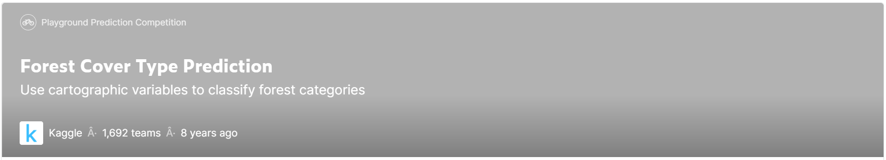

## Kaggle 竞赛 Forest Cover Type Prediction



---

### Description

在这个比赛中，你被要求从严格的地图变量（相对于遥感数据）中预测森林覆盖类型（主要的树木覆盖种类）。一个给定的30×30米单元的实际森林覆盖类型是由美国森林服务局（USFS）第二区域资源信息系统数据确定的。然后从美国地质调查局和美国林业局获得的数据中得出独立变量。数据为原始形式（未按比例），包含定性自变量的二进制列数据，如荒野地区和土壤类型。

本研究区包括位于科罗拉多州北部罗斯福国家森林的四个荒野地区。这些地区代表了人为干扰最小的森林，因此，现有的森林覆盖类型更多的是生态过程的结果，而不是森林管理实践。

### Requirement

```txt
numpy==1.23.3
pandas==1.4.4
pyecharts=2.0.1
sklearn==1.1.3
seaborn==0.11.2
torch==1.12.0+cu116
xgboost==1.7.1
lightgbm==3.3.3
```

---

项目的流程图如下


---

