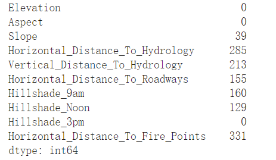
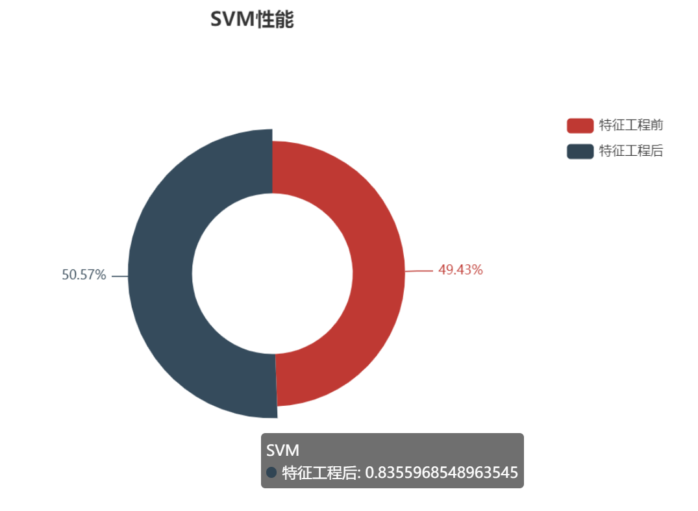
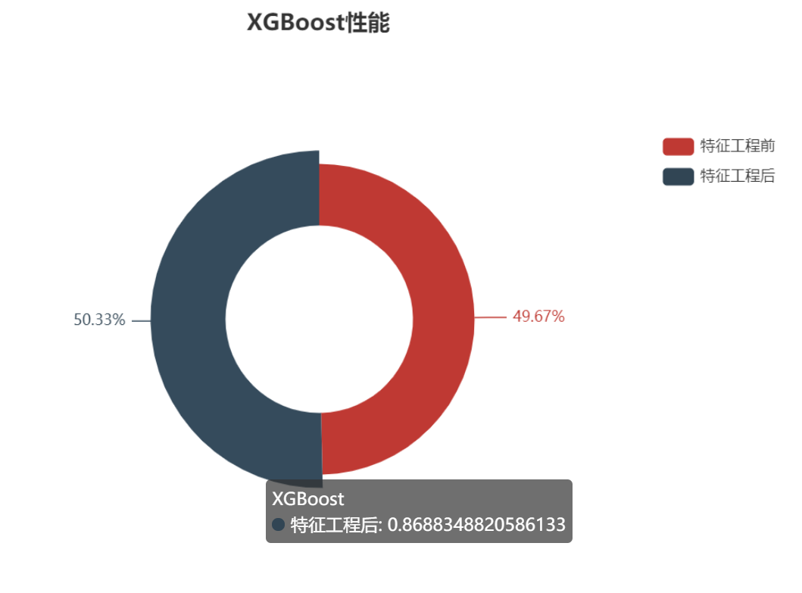

## Kaggle 竞赛 Forest Cover Type Prediction 森林覆盖类型预测


---

### Description

在这个比赛中，你被要求从严格的地图变量（相对于遥感数据）中预测森林覆盖类型（主要的树木覆盖种类）。一个给定的30×30米单元的实际森林覆盖类型是由美国森林服务局（USFS）第二区域资源信息系统数据确定的。然后从美国地质调查局和美国林业局获得的数据中得出独立变量。数据为原始形式（未按比例），包含定性自变量的二进制列数据，如荒野地区和土壤类型。

本研究区包括位于科罗拉多州北部罗斯福国家森林的四个荒野地区。这些地区代表了人为干扰最小的森林，因此，现有的森林覆盖类型更多的是生态过程的结果，而不是森林管理实践。

### Requirement

```txt
numpy==1.23.3
pandas==1.4.4
pyecharts=2.0.1
sklearn==1.1.3
seaborn==0.11.2
torch==1.12.0+cu116
xgboost==1.7.1
lightgbm==3.3.3
```

---

项目的流程图如下


我们将从这五个部分介绍本赛题。

---

## 一 赛题理解

### 1 背景
本次竞赛使用了美国森林服务局(US Forest Service)提供的30x30m分辨率的森林覆盖类型区域，包括一个训练集和一个测试集。要求采用训练集的数据对测试集的森林覆盖类型进行预测。

### 2 数据
该数据集一共有十三个属性，包括高程、坡度、坡向、到水文地物的垂直距离、水平距离、到道路的水平距离等，主要包括整形的定量数据和one-hot编码过的定名数据

### 3 评价指标
赛题中并未给出，由于模型是一个多分类问题，我们选择采用多分类交叉熵和R2系数来进行评价。

交叉熵
$$
Loss=-\sum^{c-1}_{i=0}y_i\log (p_i)
$$

R2系数 

R2系数又称决定系数，反映因变量的全部变异能通过回归关系被自变量解释的比例

$$
R^2=1-\frac{MSE}{VAR}
$$

$MSE$表示均方误差，$VAR$表示方差，值得注意的是，均方误差代表与真实值的偏差，而方差则是与平均值的偏差。

本项目的主要流程如下：


---

## 二 数据探索性分析

在本阶段，主要工作是对数据有一个简单的认识，以及对数据进行一定的预处理。

### 1 前期准备与数据读取

#### 1.1 模块导入

本次使用的模块如下：


直接先导进去吧

```python
from sklearn.model_selection import train_test_split
from sklearn.preprocessing import power_transform
import pandas as pd
import numpy as np
import seaborn as sns
import sys
from pyecharts.charts import *
from pyecharts import options as opts
from pyecharts.globals import CurrentConfig
from sklearn.preprocessing import StandardScaler,MinMaxScaler
from sklearn.model_selection import GridSearchCV
import matplotlib.pyplot as plt
import copy
import torch 
import torch.nn as nn
import alive_progress
from torch.nn import functional as F
from torch.utils.data import DataLoader,Dataset
from sklearn.model_selection import KFold
from sklearn.metrics import accuracy_score
from sklearn.preprocessing import StandardScaler
from sklearn.model_selection import cross_val_score
from sklearn.ensemble import RandomForestClassifier
import xgboost as xgb
from xgboost import plot_importance, plot_tree
import lightgbm as lgb
%matplotlib inline
```

#### 1.2 绘图模块

由于需要不停地调用可视化模块接口，这里我搞了些函数方便调用，不装`pyecharts`的话也没关系，完全可以用`matplotlib`代替的，这里只是为了美观些:star2:

```python
def DrawBox(x,y_data):
    box_plot = Boxplot()
    box_plot = (
        box_plot.add_xaxis(xaxis_data=[i for i in x])
            .add_yaxis(series_name="箱线图", y_axis=box_plot.prepare_data(y_data))
            .set_global_opts(
            title_opts=opts.TitleOpts(
                pos_left="left", title="数值数据分布情况"
            ),
            xaxis_opts=opts.AxisOpts(
                type_="category",
                boundary_gap=True,
                splitline_opts=opts.SplitLineOpts(is_show=True),  # 分割线显示与否
            ),
            yaxis_opts=opts.AxisOpts(  # y轴
                type_="value",
                splitarea_opts=opts.SplitAreaOpts(
                    is_show=True, areastyle_opts=opts.AreaStyleOpts(opacity=1)  # 横向分割
                ),
            ),
        )
    )
    return box_plot

class Draw(object):
    def __init__(self,x,y,ylabel,title,xname,yname):
        self.x=x
        self.y=y
        self.ylabel=ylabel
        self.title=title
        self.xname=xname
        self.yname=yname

    def draw(self,tool):
        tool.add_xaxis(self.x)
        for i, j in enumerate(self.y):
            tool.add_yaxis(self.ylabel[i], j)

        tool.set_series_opts(markpoint_opts=opts.MarkPointOpts(
            data=[opts.MarkPointItem(type_="max", name="最大值"),  ##设置最大值 标记
                  opts.MarkPointItem(type_="min", name="最小值"),  # 设置最小值标记
                  ], symbol='diamond', symbol_size=45), markline_opts=opts.MarkLineOpts(
            data=[opts.MarkLineItem(type_="average", name="平均值")]
        ))
        tool.set_global_opts(title_opts=opts.TitleOpts(title=self.title)
                             , toolbox_opts=opts.ToolboxOpts()
                             )
        return tool

class DrawBar(Draw):
    def __init__(self,x,y,ylabel,title,xname,yname):
        super(DrawBar, self).__init__(x,y,ylabel,title,xname,yname)
        tool=Bar()
        self.d=self.draw(tool)

    def render(self,path):
        self.d.render(path)
# 折线图
class DrawLine(Draw):
    def __init__(self,x,y,ylabel,title,xname,yname):
        super(DrawLine, self).__init__(x,y,ylabel,title,xname,yname)
        tool=Line()
        self.d=self.draw(tool)
    def render(self,path):
        self.d.render(path)
```

### 2 数据分布情况

好了结束了前期准备后，我们就可以对数据进行探索啦！这里简单举个栗子，本项目主要学习的是方法啦。数据可以在这里下载：[这里](https://www.kaggle.com/competitions/forest-cover-type-prediction/code)

读取数据并进行初步的统计量探索

```python
path=r"YourWorkSpace"
train,test=pd.read_csv(path+r"/train.csv"),pd.read_csv(path+r"/test.csv")
ori=copy.deepcopy(train)
label=train['Cover_Type']
```

查看数据表的话，用`df.head(n)`就行

```python
train.head()
```


接着是统计量：

```python
train.describe()
```


数据的维度：

```python
train.shape

# (15120,56)
```

这个数据从第十一维特征`Wilderness_Area1`开始就全是名义数据(定名数据)了，因而我们在分析其分布情况时，需要分开进行。

别忘了看看数据有没有缺失值!

```python
for i in train.columns:
    if any(train[i].isnull()):
        print(i)
for i in test.columns:
    if any(test[i].isnull()):
        print(i)
```

上面这种方式可以将带有缺失值的列获取出来，根据列特征的不同数据格式选择不同的方法进行处理。然后接下来要对样本标签的分布进行查看，如果样本分布不均衡，很可能会影响模型的训练结果。一般来说，针对分布不均衡情况，可以进行的操作有：

+ 降采样
+ 上采样
+ 生成式模型(自动编码机、受限玻尔兹曼机、对抗生成网络、扩散模型等)

```python
d=train.groupby("Cover_Type")["Id"].count()
# 通过上面的探索，我们发现实际上`Id`这一列是没有用的，那么就删除啦
train_x,label=train.iloc[:,1:-1],train.iloc[:,-1]
train.drop(['Id','Cover_Type'],axis=1,inplace=True)
test.drop('Id',axis=1,inplace=True)
DrawBar([i for i in range(1,8)],[d.tolist()],["count"],"标签均衡","cover_type","count").d.render_notebook()
```


这个数据集已经做过采样了，所以我们不需要在样本分布上做文章。

#### 2.1 数值数据分布情况

本数据集中，数值型数据刚好是前十列。

```python
numeric_col=train.columns[:10]
categorical_col=train.columns[10:]
```

利用`seaborn`的`histplot(data,kde=True)`可以在绘制数据分箱直方图的同时，绘制密度分布图，帮助我们更好的分析数据的情况。

```python
plt.figure(figsize=(16,12),dpi=200)
for idx,col in enumerate(numeric_col):
    plt.subplot(5,2,idx+1)
    sns.histplot(train[col],kde=True)
    plt.xlabel(col)
plt.tight_layout() # 调整分布
```


可以发现每种数据的分布都不相同，理论上为了方便我们的计算工作，需要将其转化为正态分布。

**:hotsprings: 数据相关性分析**

这部分主要探索数字数据之间的相关性，反映出数据分布之间的潜在联系

```python
num=train[numeric_col]
Standarder=StandardScaler()
num_std=Standarder.fit_transform(num)
num_std.mean(axis=0),num_std.std(axis=0)
plt.figure(figsize=(14,12))
sns.heatmap(num.corr(),annot=True,fmt=".2f",cmap="coolwarm")
```


可以看到的是，坡度与山体阴影呈负相关关系，像元到水文特征的垂直距离和水平距离之间具有较强的相关性。

#### 2.2 名义数据分布情况

```python
def DrawCategoricalData(x):
    d=ori.groupby([x,"Cover_Type"])["Id"].count()
    b=Bar()
    b.add_xaxis([i for i in range(1,8)])
    for i in range(2):
        c=np.array([0]*8)
        c[d[i].index]=d[i]
        b.add_yaxis(
            f"Val {i}",c[1:].tolist(),stack="1"
        )
    b.set_global_opts(title_opts=opts.TitleOpts(title="%s 数据分布情况"%x))
    return b
```

```python
categorical_col=train.columns[10:]
i=0
DrawCategoricalData(categorical_col[i]).render_notebook()
```


```python
i+=1
DrawCategoricalData(categorical_col[i]).render_notebook()
```


通过柱状堆叠图，我们可以发现，Wilderness_Area这个字段数据也是十分均衡，而且有些字段取1时，对结果取值有较大的影响，该数据的信息熵较大。

#### 3 数据清洗

此阶段主要针对三类情况：

- 缺失值
- 噪声
- 数据不一致问题

我们在第二阶段已经探查过了，该数据不存在缺失值，数据不一致问题实际上也不存在，那么剩下的就是噪声数据的处理

下面这段代码是调用上面写的绘图函数的，用来绘制箱线图，可以直接跳过，这边做个简单展示

```python
i=0
DrawBox([numeric_col[i]],[train[numeric_col[i]]]).render_notebook()
```


```python
DrawBox(numeric_col[:3],num_std[:3]).render_notebook()
```


我们可以直接用`pandas`的绘图接口：

```python
plt.figure(figsize=(16,9),dpi=300)
pd.DataFrame(num_std).boxplot()
```


可以看到，有很多类都有一些异常值。这些异常值是通过百分位数极差计算的：
$$
IQR=Q_3-Q_1
\\
IQR_b=Q_1-1.5*IQR\\
IQR_u=Q3+1.5*IQR
$$
然后我们现在就想把这些异常点去掉，有一个比较简单的方式，就是利用$3\alpha$法则

```py
def Outlier(x):
    blidx=(x.mean()-3*x.std()>x)|(x.mean()+3*x.std()<x)
    idx=np.arange(x.shape[0])[blidx]
    outlier=x.iloc[idx]
    return outlier
c=num.apply(Outlier,axis=0)
c.count()
```



可以看到，总共有`1130`个数据属于异常值。

当然，是否删除离群点还需要考虑实际情况，譬如这个离群点是由什么原因造成的？是否是采集过程中造成的，还是数据本身的特性导致的？

如果是后者，其实不建议进行处理。适当的保留噪声会提高模型的泛化能力

至此，我们已经简单完成了EDA阶段的工作。

下一个阶段是特征工程(Feature Engineering)

---

## 三 特征工程

在机器学习中，特征工程阶段的好坏往往决定了最终结果的好坏，而深度学习实际上没有这种烦恼，我们将尝试传统机器学习树模型和深度学习模型，分析并比较不同模型的结果，当然，这里会选择一份做了特征工程的数据和一份不做特征工程的数据进行比对，但由于树模型和深度学习模型都带有不确定性，最终的评价不一定准确，考虑到服务器性能，也不做大数据统计了，仅仅做一些简单的工作

特征工程的主要任务包括数据预处理、特征变换、特征提取和特征选择，在之前的工作中，我们已经做过部分预处理了，包括：

- 剔除异常值
- 删除不需要的列
- 分析数据的分布

### 1 特征变换

可以通过幂律变换`sklearn.preprogressing.power_transform`对数据进行转换，当然要求数据不能为非正数。本数据存在负数，因而我们的考量是：

+ 先做归一化去除负数影响
+ 添加极小项避免零值影响

```python
# 数据转为正态分布
t_x_d,t_y_d=train_drop_outlier.iloc[:,1:-1],train_drop_outlier.iloc[:,-1]
col_td=t_x_d[numeric_col]
mmS=MinMaxScaler()
col_td=mmS.fit_transform(col_td)
col_td+=1e-5
c_d_p=power_transform(col_td,method='box-cox')

# 查看分布
t_x_d[numeric_col]=c_d_p
t_x_d.head()

plt.figure(figsize=(16,12),dpi=200)
for idx,col in enumerate(numeric_col):
    plt.subplot(5,2,idx+1)
    sns.histplot(t_x_d[col],kde=True)
    plt.xlabel(col)
plt.tight_layout()
```


可以看到，此时之前的长尾分布基本上都被转化为近似正态了。

当然，这组数据做不做正态影响不大，起码对于信息熵没有增益，那么我们就不做了，省的数据区间出错，那么现在就轮到`特征提取`或者说`特征构造`阶段了

### 2 特征提取

主要构造的特征有：

- 高程坡向比
- 高程坡度比
- 坡度坡向比
- 水文特征切比雪夫距离
- 水文特征闵可夫斯基距离(p=1,p=2)
- 高程水文欧氏距离比
- 高程公路欧氏距离比
- 坡度公路比
- 水文公路比
- 山体阴影几何平均值
- 山体阴影平均值
- 山体阴影标准差

```python
def distance(x,y,p=2):
    return (x**p+y**p)**(1/p)
x_t_o,l_o=train_drop_outlier.iloc[:,1:-1],train_drop_outlier.iloc[:,-1]

x_t_o["v1"]=x_t_o["Elevation"]/x_t_o['Aspect']
x_t_o["v2"]=x_t_o["Elevation"]/x_t_o['Slope']
x_t_o["v3"]=x_t_o["Aspect"]/x_t_o['Slope']
x_t_o["v4"]=distance(x_t_o["Horizontal_Distance_To_Hydrology"],x_t_o['Vertical_Distance_To_Hydrology'])
x_t_o['v5']=distance(x_t_o["Horizontal_Distance_To_Hydrology"],x_t_o['Vertical_Distance_To_Hydrology'],1)
x_t_o['v6']=x_t_o['Elevation']/x_t_o['v4']
x_t_o['v7']=x_t_o['Elevation']/x_t_o['Horizontal_Distance_To_Roadways']
x_t_o['v8']=(x_t_o['Hillshade_9am']+x_t_o['Hillshade_Noon']+x_t_o['Hillshade_3pm']).mean()
x_t_o['v9']=(x_t_o['Hillshade_9am']+x_t_o['Hillshade_Noon']+x_t_o['Hillshade_3pm']).std()
x_t_o['v10']=(x_t_o['Hillshade_9am']**2+x_t_o['Hillshade_Noon']**2+x_t_o['Hillshade_3pm']**2)**0.5

```

OK现在我们就有一些奇奇怪怪的特征了。


啊实际上有些特征不能用，因为发生了除零错误。

### 3 特征选择

特征选择的方式有很多，我们现在介绍一些降维的工具：

+ 通过流形学习的非线性降维方式`T-SNE`对数据进行降维，避免数据之间冗余度过高以及可能带来的维灾害(虽然特征工程就没构建几个特征)
+ PCA
+ LDA
+ LLE

这边的话，由于特征较少，时间有限，就没有做降维了，简单给个栗子。

```python
from sklearn.decomposition import PCA
pca=PCA(n_components=10)
x=standarder.fit_transform(x_t_o)
x=pca.fit_transform(x)
```


---

## 四 模型训练

### 1 准备工作

#### 1.1 数据拆分

拆分喽

```python
x_train,x_val,y_train,y_val=train_test_split(train,label,test_size=0.3)
x_train.shape

# (10584, 54)
```

#### 1.2 标准化去除量纲影响

实际上我们之前做过一次，但是不碍事，再做一次体验一下

```python
x_train_scale=Standarder.fit_transform(x_train)
x_val_scale=Standarder.fit_transform(x_val)

def accuracy(y_pre,y):
    return sum(y_pre==y)/len(y) # 这东西用来计算预测准确度的
```

### 2 机器学习模型

#### 2.1 树模型

**随机森林:deciduous_tree:**

```python
rf=RandomForestClassifier(max_features='auto',oob_score=True,random_state=2023,n_jobs=-1)
rf.fit(x_train_scale,y_train)
rf.score(x_val_scale,y_val)
# 0.857583774250441
```

**XGboost:evergreen_tree:**

```python
# 算法参数
params = {
    # 通用参数
    'booster': 'gbtree',
    'nthread': 4,
    # 'num_feature': 5,  # Boosting过程中用到的特征维数，设置为特征个数，xgboost会自动设置，无需人为设置。
    'seed': 1000,
    # 任务参数
    'objective': 'multi:softmax',  # 多分类问题
    'num_class': 7,  #类别总数，与multi softmax并用 6
    # 提升参数
    'gamma': 0.1,
    'max_depth': 11,
    'lambda': 2,
    'subsample': 0.7,
    'colsample_bytree': 0.7,
    'min_child_weight': 5,
    'eta': 0.1,
    # 'eval_metric': 'auc'
}
# 注意多分类xgboost需要修改label映射
y_train_xg=y_train-1
y_val_xg=y_val-1

dtrain=xgb.DMatrix(data=x_train_scale,label=y_train_xg)
dtest=xgb.DMatrix(data=x_val_scale,label=y_val_xg)
watchlist=[(dtrain,"train"),(dtest,"valid_data")]
model=xgb.train(params,dtrain,num_boost_round=2023,evals=watchlist,early_stopping_rounds=200,verbose_eval=500)
accuracy(model.predict(dtest),y_val_xg)

#0.8507495590828924 
```

```python
xgb.plot_importance(model,height=0.8,title='Influence Ranking', ylabel='Feature',max_num_features=20)
```

查看特征影响得分：


**LightGBM:palm_tree:**

```python
params={'num_leaves':54,'objective': 'multi:softmax','max_depth':18,'learning_rate':0.01,'boosting':'gbdt'}
model=lgb.LGBMClassifier(**params,n_estimators=2000,nthread=4,n_jobs=-1)
model.fit(x_train_scale,y_train,verbose=200)
accuracy(model.predict(x_val_scale,num_iteration=model.best_iteration_),y_val)

# 0.8630952380952381
```

#### 2.2 支持向量机

```python
from sklearn import svm
param_grid={
    "gamma":[0.05*i for i in range(1,13)],
    "C":[0.1*i for i in range(1,21)]
}
cl=svm.SVC(kernel='poly',gamma=0.1,decision_function_shape='ovo',C=1.0)
search=GridSearchCV(cl,param_grid=param_grid,cv=5,n_jobs=-1, scoring="accuracy")
search.fit(x_train_scale,y_train)
cl=search.best_estimator_
z=cl.predict(x_val_scale)

# 0.8167989417989417
```


#### 2.3 优化

讲到调优，机器学习的两大工作一个是特征工程，一个就是调参了，努力成为一名优秀的调参侠吧(笑)

我们通过`GridSearchCV`模块进行调参，以决策树和XGboost为例：

```python
param_grid={
    'n_estimators':[i for i in range(10,20)],
    'max_depth':[i*2 for i in range(10)],
    'criterion':['entropy','gini'],
}
rf=RandomForestClassifier(max_features='auto',oob_score=True,random_state=2023,n_jobs=-1)
clf=GridSearchCV(estimator=rf,param_grid=param_grid,scoring='accuracy',cv=5,n_jobs=-1)
clf.fit(x_train_scale,y_train)
lr=clf.best_estimator_
lr.fit(x_train_scale,y_train)
m1=lr.predict(x_val_scale)
accuracy(m1,y_val)
```

通过格网搜索与交叉验证，寻找模型的最优参数。

```python
pipe = Pipeline(
        steps=[ ("classifier", XGBClassifier())]
    )
param_grid = {
        "classifier__n_estimators": [50,100,150,200,300], # 多少棵树
        "classifier__eta": [0.05, 0.1, 0,2, 0.3], # 学习率
        "classifier__max_depth": [3,4,5,6,7], # 树的最大深度
        "classifier__colsample_bytree": [0.4,0.6,0.8,1], # 选择多少列构建一个树
        "classifier__min_child_weight": [1,2,3,4] # 叶子节点最小样本数目
    }
search = GridSearchCV(pipe, param_grid, n_jobs=-1, scoring="roc_auc", cv=5)
search.fit(x_train_scale,y_train_xg)
search.best_params
search.score(x_val_scale,y_val_xg)
```

这个过程十分吃服务器性能，而且可能费时不太好，需要一定的心理准备。

最终的结果如下(具有一定的优化空间，我这边基本上没怎么做调参)


### 3 深度学习模型

#### 3.1 构建数据集

首先我们要有一个数据集，或者一个可迭代的容器存放我们的数据

```python
class MyDataSet(Dataset):
    def __init__(self,x,label):
        self.x,self.label=x,label

    def __getitem__(self, idx):
        return self.x[idx],self.label[idx]

    def __len__(self):
        return len(self.x)
```

然后是将数据转化为`tensor`格式

```python
x_t_tensor=torch.from_numpy(x_train_scale).float()
y_t_tensor=torch.LongTensor(y_train_xg.to_numpy()).reshape(-1,1)
y_t_tensor=torch.zeros(y_t_tensor.shape[0],7).scatter_(1, y_t_tensor, 1)

x_v_tensor=torch.from_numpy(x_val_scale).float()
y_v_tensor=torch.torch.LongTensor(y_val_xg.to_numpy()).reshape(-1,1)
y_v_tensor=torch.zeros(y_v_tensor.shape[0],7).scatter_(1, y_v_tensor, 1)
```

再者是将这些放到数据容器中：

```python
train_DataLoader=DataLoader(
    dataset=MyDataSet(x_t_tensor,y_t_tensor),
    batch_size=64,
    shuffle=True,
    drop_last=True
)

test_DataLoader=DataLoader(
    dataset=MyDataSet(x_v_tensor,y_v_tensor),
    batch_size=64,
    shuffle=True,
    drop_last=True
)
```

#### 3.2 模型选择

目前，我们已经获得了七个简单的网络。值得注意的是，在简单的一维数据中，多层感知机理论上可以拟合任意的函数，但如果加大层数，用一些高维数据的tricks，反而不太能得到好的结果。这是因为复杂的网络其容量也会增大，想要在函数域中找到最优函数变得更加复杂，可能陷入局部最优解

再有，一维卷积神经网络的性能实际上在小样本上会略低于全连接层，也不太适合做Attention

网络的性能除却跟网络结构本身有关系外，主要还是与数据挂钩。吴恩达在CS229中说过，模型只是去逼近数据潜在的上限，目前，我们拿出来做深度学习的数据仅仅做过几个简单的处理，实际上后续可以考虑将做过特征工程的数据进行训练

```python
class Net(nn.Module):
    def __init__(self,in_features=54,n_hidden1=128,n_hidden2=256,out_features=7):
        super(Net, self).__init__()
        self.flatten=nn.Flatten()
        self.hidden1=nn.Sequential(
            nn.Linear(in_features,n_hidden1,False),
            nn.BatchNorm1d(n_hidden1),
            nn.ReLU()
        )
        self.hidden2=nn.Sequential(
            nn.Linear(n_hidden1,n_hidden2),
            nn.BatchNorm1d(n_hidden2),
            nn.ReLU()
        )
        self.out=nn.Sequential(nn.Linear(n_hidden2,out_features))

    def forward(self,x):
        x=self.flatten(x)
        x=self.hidden2(self.hidden1(x))
        return F.softmax(self.out(x),dim=1)

class BasicConv1d(nn.Module):
    # 一个Conv+Bn+ReLU
    def __init__(self,in_channel,out_channel,kernel,stride,padding=0):
        super(BasicConv1d, self).__init__()
        self.cbr=nn.Sequential(
            nn.Conv1d(in_channels=in_channel,out_channels=out_channel,kernel_size=kernel,stride=stride,
                      padding=padding),
            nn.BatchNorm1d(out_channel,eps=0.001,momentum=0.1,affine=True),
            nn.ReLU(inplace=False)
        )
    def forward(self,x):
        return self.cbr(x)

# 一个简单的Inception模块
class Mixed_5b(nn.Module):
    def __init__(self):
        super(Mixed_5b, self).__init__()
        self.branch0=BasicConv1d(54,96,kernel=1,stride=1)
        self.branch1=nn.Sequential(
            BasicConv1d(54,48,kernel=1,stride=1),
            BasicConv1d(48,64,5,1,2)
        )
        self.branch2=nn.Sequential(
            BasicConv1d(54,64,kernel=1,stride=1),
            BasicConv1d(64,96,kernel=3,stride=1,padding=1),
            BasicConv1d(96,96,kernel=3,stride=1,padding=1)
        )
        self.branch3=nn.Sequential(
            BasicConv1d(54,64,1,1),
        )

        self.linear=nn.Sequential(
            nn.BatchNorm1d(320),
            nn.ReLU(),
            nn.Flatten(),
            nn.Dropout(0.5),
            nn.Linear(320,256),
            nn.BatchNorm1d(256),
            nn.ReLU(),
            nn.Linear(256,7),
            nn.Softmax(dim=1)
        )

    def forward(self,x):
        x = x.view(x.size(0),x.size(1),1)
        x0=self.branch0(x)
        x1=self.branch1(x)
        x2=self.branch2(x)
        x3=self.branch3(x)
        out=torch.cat((x0,x1,x2,x3),1)
        
        return self.linear(out)

class Block35(nn.Module):
    def __init__(self,scale=1.0):
        super(Block35,self).__init__()
        self.scale=scale
        self.branch0=BasicConv1d(54,32,kernel=1,stride=1)
        self.branch1=nn.Sequential(
            BasicConv1d(54,32,1,1),
            BasicConv1d(32,32,3,1,1)
        )
        self.branch2=nn.Sequential(
            BasicConv1d(54,32,1,1),
            BasicConv1d(32,48,3,1,1),
            BasicConv1d(48,64,3,1,1)
        )
        self.conv1d=nn.Conv1d(128,54,kernel_size=1,stride=1)
        self.relu=nn.ReLU(inplace=False)
        self.Linear=nn.Sequential(
            nn.Flatten(),
            nn.Linear(54,256,1),
            nn.BatchNorm1d(256),
            nn.ReLU(),
            nn.Linear(256,7,1)
        )

    def forward(self,x):
        x = x.view(x.size(0),x.size(1),1)
        x0,x1,x2=self.branch0(x),self.branch1(x),self.branch2(x)
        out=torch.cat((x0,x1,x2),1)
        out=self.conv1d(out)
        out=out*self.scale+x
        out=self.relu(out)
        return F.softmax(self.Linear(out),dim=1)
    
    
class Net2(nn.Module):
    def __init__(self):
        super(Net2, self).__init__()
        self.conv1=nn.Conv1d(54,128,1)
        self.conv2=nn.Conv1d(54,128,1)
        self.conv3=nn.Conv1d(54,128,1)
        self.re=nn.ReLU()
        self.bn1=nn.BatchNorm1d(128)
        
        self.Conv=nn.Sequential(
            nn.ReLU(),
            nn.Conv1d(128, 164,1,1),
            nn.BatchNorm1d(164),
            nn.ReLU(),
            nn.Conv1d(164, 128,1,1),
            nn.Dropout(0.5),
            nn.BatchNorm1d(128),
            nn.ReLU()
        )
        self.fl=nn.Flatten()
        self.Linear=nn.Sequential(

            nn.Linear(128, 256),
            nn.Dropout(0.5),
            nn.BatchNorm1d(256),
            nn.LeakyReLU(),
            nn.Linear(256, 128),
            nn.BatchNorm1d(128),
            nn.ReLU(),
            nn.Linear(128, 7),
            nn.Softmax(dim=1)
        )


    def forward(self,x):
        x = x.view(x.size(0),x.size(1),1)
        x1=self.conv1(x)
        x3=self.conv3(x)
        x2=self.conv2(x)
        x=self.re(self.bn1(x1+x2+x3))
        x=self.Conv(x)
        x=self.fl(x)
        
    
        
       
        return self.Linear(x)
    
class Net3(nn.Module):
    def __init__(self,in_features=54,n_hidden1=128,n_hidden2=256,n_hidden3=512,out_features=7):
        super(Net3, self).__init__()
        self.flatten=nn.Flatten()
        self.hidden1=nn.Sequential(
            nn.Linear(in_features,n_hidden1,False),
            nn.BatchNorm1d(n_hidden1),
            nn.ReLU()
        )
        self.hidden2=nn.Sequential(
            nn.Linear(n_hidden1,n_hidden2),
            nn.BatchNorm1d(n_hidden2),
            nn.ReLU()
        )
        self.hidden3=nn.Sequential(
            nn.Linear(n_hidden2,n_hidden3),
            nn.BatchNorm1d(n_hidden3),
            nn.ReLU()
        )
        self.out=nn.Sequential(nn.Linear(n_hidden3,out_features))

    def forward(self,x):
        x=self.flatten(x)
        x=self.hidden2(self.hidden1(x))
        x=self.hidden3(x)
        return F.softmax(self.out(x),dim=1)
    
class Net4(nn.Module):
    def __init__(self,in_features=54,n_hidden1=128,n_hidden2=256,n_hidden3=512,out_features=7):
        super(Net4, self).__init__()
        self.flatten=nn.Flatten()
        self.hidden1=nn.Sequential(
            nn.Linear(in_features,n_hidden1,False),
            nn.BatchNorm1d(n_hidden1),
            nn.ReLU()
        )
        self.hidden2=nn.Sequential(
            nn.Linear(in_features,n_hidden2),
            nn.BatchNorm1d(n_hidden2),
            nn.ReLU()
        )
        self.hidden3=nn.Sequential(
            nn.Linear(n_hidden1+n_hidden2,n_hidden3),
            nn.BatchNorm1d(n_hidden3),
            nn.ReLU()
        )
        self.out=nn.Sequential(nn.Linear(n_hidden3,out_features))

    def forward(self,x):
        x=self.flatten(x)
        x1=self.hidden1(x)
        x2=self.hidden2(x)
        x=self.hidden3(torch.concat([x1,x2],dim=1))
        return F.softmax(self.out(x),dim=1)
    
    
class Net5(nn.Module):
    def __init__(self,in_features=54,n_hidden1=54,n_hidden2=256,n_hidden3=512,out_features=7):
        super(Net5, self).__init__()
        self.flatten=nn.Flatten()
        self.hidden1=nn.Sequential(
            nn.Linear(in_features,n_hidden1,False),
            nn.BatchNorm1d(n_hidden1),
            nn.ReLU()
        )
        self.hidden2=nn.Sequential(
            nn.Linear(in_features,n_hidden2),
            nn.BatchNorm1d(n_hidden2),
            nn.ReLU()
        )
        self.hidden3=nn.Sequential(
            nn.Linear(n_hidden2,n_hidden2),
            nn.BatchNorm1d(n_hidden2),
            nn.ReLU()
        )
        self.hidden4=nn.Sequential(
            nn.Linear(n_hidden2,n_hidden3),
            nn.BatchNorm1d(n_hidden3),
            nn.ReLU(),

        )
        self.out=nn.Sequential(nn.Linear(n_hidden3,out_features))

    def forward(self,x):
        x=self.flatten(x)
        x1=self.hidden1(x)
        x2=self.hidden2(x+x1)
        x3=self.hidden3(x2)
        o=self.hidden4(x3+x2)
        return F.softmax(self.out(o),dim=1)
    
    
class Net6(nn.Module):
    def __init__(self,in_features=54,n_hidden1=54,n_hidden2=512,n_hidden3=1024,out_features=7):
        super(Net6, self).__init__()
        self.flatten=nn.Flatten()
        self.hidden1=nn.Sequential(
            nn.Linear(in_features,n_hidden1,False),
            nn.BatchNorm1d(n_hidden1),
            nn.ReLU()
        )
        self.hidden2=nn.Sequential(
            nn.Linear(in_features,n_hidden1),
            nn.Dropout(0.5),
            nn.BatchNorm1d(n_hidden1),
            nn.ReLU()
        )
        self.hidden3=nn.Sequential(
            nn.Linear(in_features,n_hidden2),
            nn.BatchNorm1d(n_hidden2),
            nn.ReLU()
        )
        self.hidden5=nn.Sequential(
            nn.Linear(n_hidden2,n_hidden3),
            nn.BatchNorm1d(n_hidden3),
            nn.ReLU()
        )
        self.out=nn.Sequential(nn.Linear(n_hidden3,out_features))

    def forward(self,x):
        x=self.flatten(x)
        x1=self.hidden1(x)
        x2=self.hidden2(x)
        x3=self.hidden3(x2+x1+x)

        o=self.hidden5(x3)
        
        return F.softmax(self.out(o),dim=1)

```

#### 3.3 训练阶段

```python
Net_train_loss=[]
def train(model,seed,epoch=200):
    global Net_train_loss
    # 这边统一用交叉熵和自适应距估计优化器
    path=r"YourPath\%s.pth"%seed
    criterion=nn.CrossEntropyLoss()
    optimizer=torch.optim.Adam(model.parameters(),lr=1e-4,betas=(0.9,0.99),
                               eps=1e-08,weight_decay=0)
    device="cuda" if torch.cuda.is_available() else "cpu"
    model.to(device)
    criterion.to(device)
    Loss=[]
    Acc=[]
    ELoss=[]
    EAcc=[]
    BEST_ACC=0

    for e in range(epoch):
        train_loss = 0
        train_acc=0
        model.train()
        with alive_progress.alive_bar(len(train_DataLoader),force_tty=True) as bar:
            for idx,(x,y) in enumerate(train_DataLoader):
                x,y=x.to(device),y.to(device)
                y_pre=model(x)

                optimizer.zero_grad()
                loss=criterion(y,y_pre)
                loss.backward()
                optimizer.step()

                train_loss+=loss.item()
                _,pre=y_pre.max(1)
    
                num_correct=(pre.to("cpu")==np.argmax(y.to("cpu"),axis=1)).sum().item()
                acc=num_correct/x.shape[0]
                train_acc+=acc
                bar()
        if (k:=train_acc/len(train_DataLoader))>BEST_ACC:
            BEST_ACC=k
            
            state = {
                'epoch': e,
                'best_acc': k,
                'model_state_dict': model.state_dict(),
                'optimizer_state_dict': optimizer.state_dict(),
            }
            torch.save(state, path)
        Loss.append(train_loss/len(train_DataLoader))
        Acc.append(train_acc/len(train_DataLoader))
        print(f"epoch : {e+1} / {epoch}")
        print(f"Train Loss : {train_loss/len(train_DataLoader)}, Train Acc : {train_acc/len(train_DataLoader)}")
    Net_train_loss.append(Acc)
```

```python
net1=Net()
train(net1,"Net1")

net2=Mixed_5b()
train(net2,"Net2")

net3=Net3()
train(net3,"Net3")

net4=Block35()
train(net4,"Net4")

net5=Net4()
train(net5,"Net5")

net6=Net5()
train(net6,"Net6")

net7=Net6()
train(net7,"Net7")
```

训练结束后，我们就可以载入模型的参数和结果啦。

```python
# 加载最优参数
Nets=[net1,net2,net3,net4,net5,net6,net7]
BestAcc=[]
for i in range(1,8):
    checkpoint=torch.load(r"YourPath\Net%s.pth"%i)
    Nets[i-1].load_state_dict(checkpoint["model_state_dict"])
    BestAcc.append(checkpoint["best_acc"])
```

我们用训练好的模型去计算在验证集上的结果：

```python
pre=[]
eval_acc=[]
for i in Nets:
    i.eval()
    i.to("cpu")
    net_pre=i(x_v_tensor)
    eval_acc.append(accuracy(torch.max(net_pre,1)[1],y_v_tensor.argmax(1)).item())
    if pre==[]:
        pre=net_pre
    else:
        pre+=net_pre
```

```python
# 查看验证集和训练集精度变化情况
b=Bar()
b.add_xaxis(["Net%i"%i for i in range(1,8)])
b.add_yaxis("Train Acc",[round(i,3) for i in BestAcc])
b.add_yaxis("Val Acc",[round(i,3) for i in eval_acc])
b.set_series_opts(markpoint_opts=opts.MarkPointOpts(
        data=[opts.MarkPointItem(type_="max", name="最大值"),  ##设置最大值 标记
              opts.MarkPointItem(type_="min", name="最小值"),  # 设置最小值标记
              ], symbol='pin', symbol_size=60), markline_opts=opts.MarkLineOpts(
        data=[opts.MarkLineItem(type_="average", name="平均值")]
    ))
b.render_notebook()
```


可以看到，在验证集上，模型的性能有所下降，这是由于原本的模型对于训练集发生了过拟合现象。Net1实际上是最简单的二层全连接层，尽管它的训练速度最快，参数最少，在训练集上表现良好，但其泛化能力远不如其他模型。而Net2则对验证集的表现良好。

总体来说，模型在验证集上的平均精度略微下降。

## 五 模型融合

模型融合通过提升特征多样性、样本多样性和模态多样性，可以进一步增加模型的泛化能力和鲁棒性。

根据方法的不同，可以分为过程融合和结果融合。

**过程融合:watermelon:**

过程融合最基本的有Bagging和Boosting，Bagging就是多个弱分类器堆叠在一起，Boosting就是基于弱分类器分错的结果输入后一个分类器中，从而实现弱模型媲美强模型的过程。

**结果融合:banana:**

主要有以下几种方法

- 加权法
- stacking
- Blending

我们这边使用结果融合，通过尝试直接叠加法、软投票法和Stacking方式，分析并给出一个相对较好的结果

### 1 线性融合

#### 1.1 投票法

```python
z_1=accuracy(torch.max(pre,1)[1],y_v_tensor.argmax(1)).item() # 直接投票
```

#### 2.2 加权投票

```python
# 结果加权投票
def vote(weight):
    pre_1=[]
    for _,i in enumerate(Nets):
        i.eval()
        i.to("cpu")
        net_pre=i(x_v_tensor)*weight[_]
        if pre_1==[]:
            pre_1=net_pre
        else:
            pre_1+=net_pre
    return pre_1

z_2=accuracy(torch.max(vote(eval_acc),1)[1],y_v_tensor.argmax(1)).item()
```

#### 2.3 软投票

```python
# 基于Softmax投票
k=sum([np.exp(i) for i in eval_acc])
sm=[np.exp(i)/k for i in eval_acc]
z_3=accuracy(torch.max(vote(sm),1)[1],y_v_tensor.argmax(1)).item()
```

### 2 Stacking

将多个分类器的概率结果作为一个简单分类器的输入，经过该分类器进行输出，我们这边执行两种方法：

- 数值叠加
- 特征叠加

简单分类器选择一个简单的NN

```python
class NN(nn.Module):
    def __init__(self,in_channel=7,out_channel=7):
        super(NN, self).__init__()
        self.hidden=nn.Sequential(
            nn.Linear(in_channel,128),
            nn.BatchNorm1d(128),
            nn.ReLU(),
            nn.Linear(128,256),
            nn.BatchNorm1d(256),
            nn.ReLU(),
            nn.Linear(256,648),
            nn.BatchNorm1d(648),
            nn.Dropout(0.2),
            nn.ReLU(),
            nn.Linear(648,7)
        )
    def forward(self,x):
        return F.softmax(self.hidden(x))
```

#### 2.1 数值叠加

```python
# 数值叠加
input_data=[]
for _,i in enumerate(Nets):
    i.eval()
    i.to("cpu")
    net_pre=i(x_t_tensor)
    if input_data==[]:
        input_data=net_pre
    else:
        input_data+=net_pre
x=input_data.tolist()
input_data=torch.tensor(x)
input_data.shape
```

值得注意的是，这里通过`tolist()`来回转换变换内存地址，否则`torch`在反向传播执行计算图时会把上面那段代码也算进去，导致报错。

```python
# 数据集
stackingData=DataLoader(MyDataSet(input_data.float(),y_t_tensor),batch_size=64,shuffle=True,drop_last=True)
# 模型
net_s_1=NN(7,7)
# 训练
train(net_s_1,"Net_S_1",n=stackingData,epoch=50)
# 载入
net_s_1.load_state_dict(torch.load(r"YourPath\Net_S_1.pth")["model_state_dict"])
net_s_1.to("cpu")
# 预测结果
z_4=accuracy(torch.max(net_s_1(pre),1)[1],y_v_tensor.max(1)[1]).item()
```

#### 2.2 特征叠加

```python
# 特征叠加
input_data=[]
for _,i in enumerate(Nets):
    i.eval()
    i.to("cpu")
    net_pre=i(x_t_tensor)
    if input_data==[]:
        input_data=net_pre
    else:
        input_data=torch.concat([input_data,net_pre],1)
x=input_data.tolist()
input_data=torch.tensor(x)
input_data.shape
```

```python
stackingData=DataLoader(MyDataSet(input_data.float(),y_t_tensor),batch_size=64,shuffle=True,drop_last=True)
net_s_2=NN(49,7)
train(net_s_2,"Net_S_2",n=stackingData,epoch=200)
net_s_2.load_state_dict(torch.load(r"YourPath\Net_S_2.pth")["model_state_dict"])
net_s_2.to("cpu")
z_5=accuracy(torch.max(net_s_1(pre),1)[1],y_v_tensor.max(1)[1]).item()
```

### 3 结果分析

```python
b=Line()
b.add_xaxis(["直接投票","结果分配投票","Softmax软投票","数据叠加","特征叠加"])
b.add_yaxis("结果精度",[round(i,5) for i in [z_1,z_2,z_3,z_4,z_5]])
b.set_global_opts(yaxis_opts=opts.AxisOpts(min_="dataMin",max_="dataMax"))
b.render_notebook()
```


之前单模在验证集上最高的0.888，平均是0.86，特征叠加的结果会优于之前单模最好结果。

值得一提的是，特征叠加的方法在训练集上最高性能达到了0.93，这个结果远超之前单模的最好结果0.894。当然，用深度学习网络作为输出分类器，高收益的同时也带来了高风险，根据输出分类器的性能，最终结果也会上下浮动。为了避免这种情况，我们其实可以使用Ridge回归、Lasso回归、简单随机森林等模型作为输出模型。

---

## 六 结果分析

**以下是各模型的分类性能**

```python
b=Bar()
b.add_xaxis([i for i in ML_PRE.keys()]+["Net%s"%i for i in range(1,7)])
b.add_yaxis("机器学习准确率",[round(i[1],3) for i in ML_PRE.values()],markpoint_opts=opts.MarkPointOpts(
            data=[opts.MarkPointItem(type_="min", name="最小值"),opts.MarkPointItem(type_="max",name="最大值")],symbol='pin', symbol_size=55))
b.add_yaxis("深度学习准确率",[None]*4+[round(i,3) for i in eval_acc],markpoint_opts=opts.MarkPointOpts(
            data=[opts.MarkPointItem(type_="min", name="最小值"),opts.MarkPointItem(type_="max",name="最大值")],symbol='arrow', symbol_size=55))
b.set_global_opts(xaxis_opts=opts.AxisOpts(axislabel_opts=opts.LabelOpts(rotate=-15)),
                     title_opts=opts.TitleOpts(title="模型准确率"))
b.render_notebook()
```


在小样本跟少量特征的情况下，机器学习模型的性能与深度学习模型的性能差距不大，当然这里的深度学习模型只是一些非常简单的模型。

**以下是性能最强的两个深度学习模型与两个最强的机器学习模型进行融合的结果**

```python
# Net3 Net6
net3,net6=Nets[2],Nets[-1]
# 做个最简单的线性加权
z1=torch.max(net3(x_v_tensor),1)[1]+1
z2=torch.max(net6(x_v_tensor),1)[1]+1
z3=ML_PRE['LightGBM'][0]
z4=ML_PRE['RF'][0]
z=torch.concat([z1.reshape(z1.shape[0],1),z2.reshape(z1.shape[0],1),torch.Tensor(z3).reshape(z1.shape[0],1),torch.Tensor(z4).reshape(z1.shape[0],1)],dim=1)
e=pd.DataFrame(z.numpy())
# 后处理
# 一般在提交的时候整的
# 取众数就好了
ans=[]
for i in range(e.shape[0]):
    ans.append(e.iloc[i].mode().values[0])
accuracy(ans,y_val)

# 0.8838183421516755
```

emm，这个性能略好于Net6，大于机器学习模型，小于Net3。

值得注意的是，在后处理过程中，模型投票产生的结果可能是：

+ 四票全中
+ 三票A一票B
+ 两票A两票B
+ 两票A一票B一票C
+ ABCD各一票

由于这里是把结果拿出来了而不是概率(概率请参考深度学习融合)，所以我们规定：三票四票的直接就是输出标签，两票A两票B选择创建分支，两票A一票B一票C选择A，ABCD各一票则随机选。

举个简单的后处理栗子：

```python
ans=[]
ans2=[]
for i in range(e.shape[0]):
    v=[0]*8
    fir=True
    c=0
    for j in range(e.shape[1]):
        v[int(e.iloc[i,j])]+=1
    for idx,_ in enumerate(v):
        if _==4 or _==3:
            ans.append(idx)
            ans2.append(idx)
            break
        elif _==2:
            if fir:
                ans.append(idx)
                ans2.append(idx)
                fir=False
            else:
                ans2[-1]=idx
                break
        elif _==1:
            c+=1
    if c==4:
        ans.append(e.iloc[i,0])
        ans2.append(e.iloc[i,2])
```

这段代码是我在半夜三点神志不清的时候写的，难免像坨屎，应该有很大的优化空间。但不管怎么说，这种后处理方式确实拿到了更好的结果：

```python
accuracy(ans,y_val) # 0.8833774250440917
accuracy(ans2,y_val) # 0.8893298059964727
```

这个结果超过了之前单模最好结果Net3，算是有提升吧。

实际上，我们对深度学习模型的融合也需要进行后处理，这样也能提高些分数。

就不做Stacking了，大概就是这样

**以下是特征工程对于机器学习模型的提升**


这个图不太直观啊，我们逐个来看看是否有提升：







这里面仅仅构建了几个简单的特征，剔除了异常值，结果得到了明显的提升。但是相应的，异常值会带来泛化能力的提高，模型抗风险能力变小。

